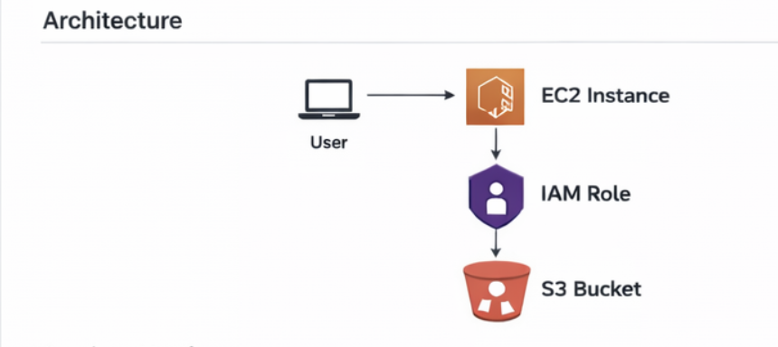
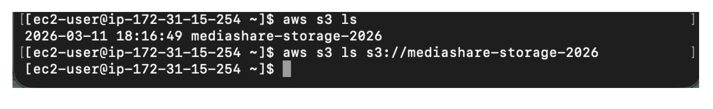
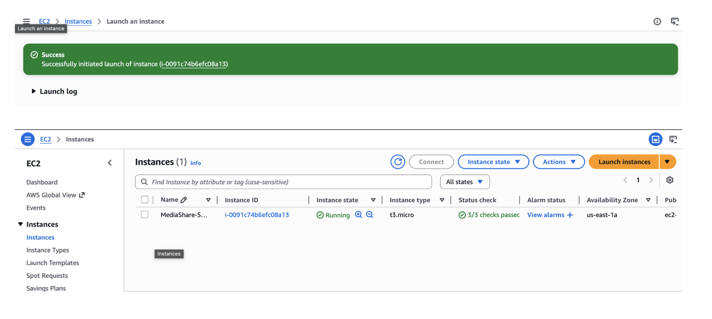
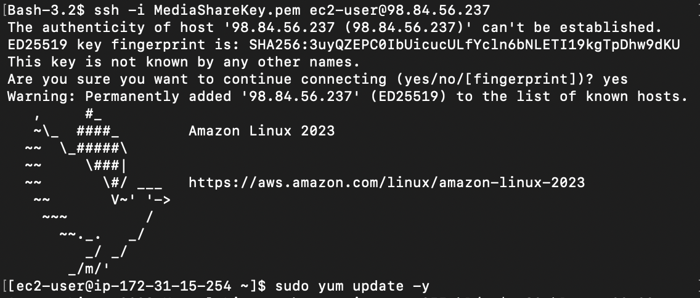
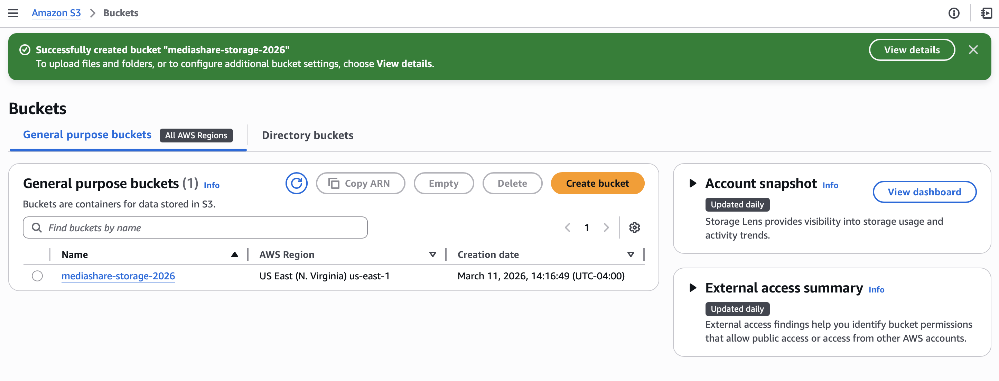
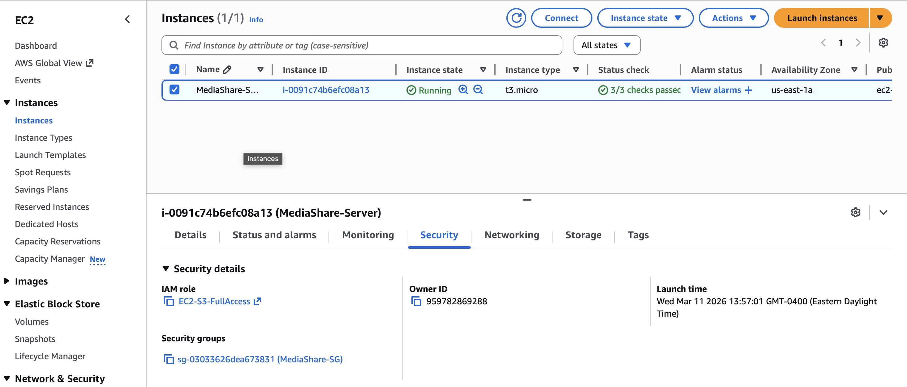
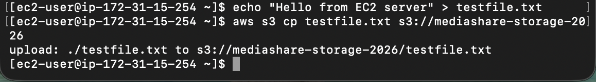
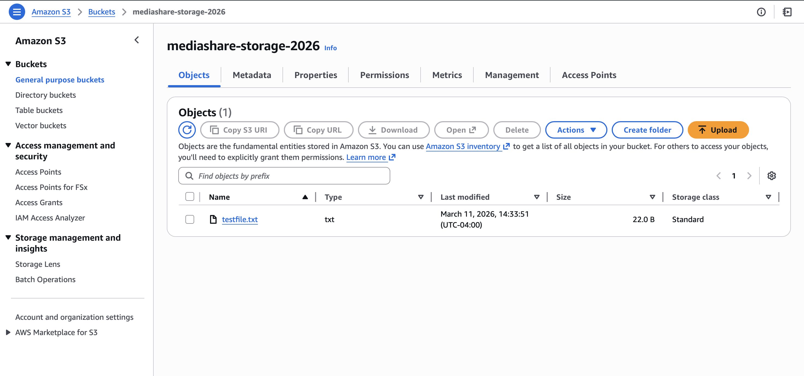

# AWS EC2 and S3 Integration using IAM Roles

> Deployed a Linux EC2 instance integrated with S3 using IAM roles — secure file transfer via AWS CLI without hardcoded credentials.

## Overview

| | |
|---|---|
| **Role** | Cloud Engineer |
| **Domain** | AWS Compute, Storage, Security |
| **Tools** | Amazon EC2 · Amazon S3 · AWS IAM · AWS CLI · SSH |

---

## Architecture



| Component | Purpose |
|---|---|
| **Amazon EC2** | Virtual Linux server to run commands and create files |
| **Amazon S3** | Cloud storage for files uploaded from EC2 |
| **IAM Role** | Grants EC2 secure access to S3 without storing credentials |
| **Security Group** | Controls network access to the EC2 instance |
| **AWS CLI** | Used to upload files from EC2 to S3 |

---

## Implementation Steps

### Configure AWS CLI
Configured the AWS CLI to securely interact with the AWS account from the terminal.



---

### Launch EC2 Instance
Created an Amazon EC2 instance using Free Tier and configured a security group to allow SSH access.



---

### Connect to EC2 via SSH
Connected securely to the EC2 instance using a key pair.
```bash
ssh -i MediaShareKey.pem ec2-user@public-ip
```



---

### Create S3 Bucket
Created an S3 bucket to store files generated by the EC2 instance.



---

### Configure IAM Role
Created and attached an IAM role to allow the EC2 instance to access S3 securely.



---

### Upload File from EC2 to S3
```bash
echo "Hello from EC2 server" > testfile.txt
aws s3 cp testfile.txt s3://mediashare-storage-2026
```





---

## Challenges & Solutions

| Challenge | Solution |
|---|---|
| SSH timeout | Updated security group to allow inbound traffic on port 22 |
| S3 upload failed | Attached IAM role with proper S3 write permissions |
| AWS CLI credential error | Reconfigured CLI to authenticate correctly |

---

## Future Improvements

- Automate infrastructure using **Terraform**
- Deploy a web application on EC2
- Implement a **CI/CD pipeline**
- Add monitoring using **CloudWatch**

---

## Skills Demonstrated

`Amazon EC2` `Amazon S3` `AWS IAM` `AWS CLI` `SSH`
`IAM Roles` `Security Groups` `Linux` `Cloud Infrastructure` `Secure Service Integration`
